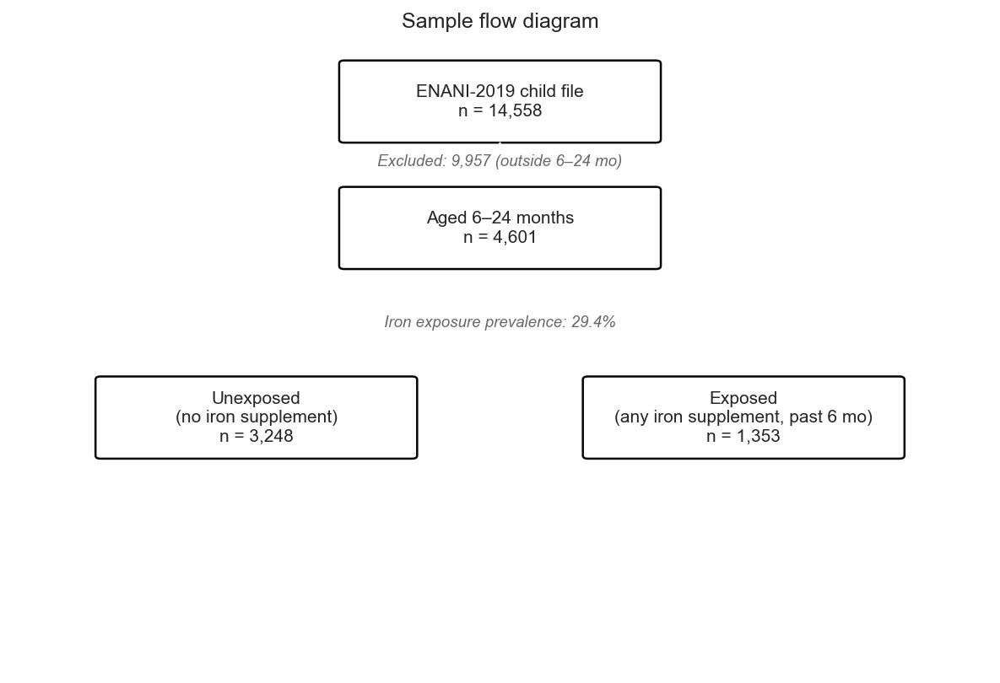
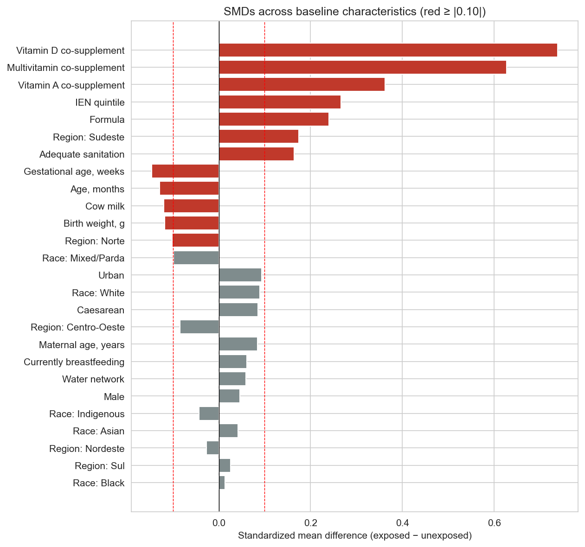

# 01 — Baseline characteristics of the analytic sample (Table 1)

**Sample:** Brazilian infants aged 6–24 months from ENANI-2019.

**Analytic n:** 4,601 infants. **Iron-exposed:** 1,353 (29.4%); **unexposed:** 3,248.

Group differences are reported for transparency (chi-square / Fisher / Welch t-test) alongside standardized mean differences (SMDs). |SMD| ≥ 0.10 flags variables for which adjustment is likely necessary in subsequent analyses.

---

## Sample flow

## Table 1 — Baseline characteristics by iron supplementation status

| Characteristic                                                        | Total                    | Unexposed                | Exposed                  | N (obs)   | Test    | p-value   | SMD    |
|:----------------------------------------------------------------------|:-------------------------|:-------------------------|:-------------------------|:----------|:--------|:----------|:-------|
| — Demographic —                                                       |                          |                          |                          |           |         |           |        |
| Age, months — mean (SD)                                               | 15.08 (5.45)             | 15.28 (5.54)             | 14.59 (5.20)             | 4601      | Welch t | 0.0001    | -0.129 |
| Age band — n (%) [95% CI]                                             |                          |                          |                          | 4601      | Chi²    | 0.0004    |        |
| 6–11 mo                                                               | 1415 (30.8) [29.4, 32.1] | 974 (30.0) [28.4, 31.6]  | 441 (32.6) [30.1, 35.1]  |           |         |           | +0.056 |
| 12–17 mo                                                              | 1477 (32.1) [30.8, 33.5] | 1009 (31.1) [29.5, 32.7] | 468 (34.6) [32.1, 37.2]  |           |         |           | +0.075 |
| 18–24 mo                                                              | 1709 (37.1) [35.8, 38.6] | 1265 (38.9) [37.3, 40.6] | 444 (32.8) [30.4, 35.4]  |           |         |           | -0.128 |
| Male — n (%) [95% CI]                                                 | 2360 (51.3) [49.8, 52.7] | 1644 (50.6) [48.9, 52.3] | 716 (52.9) [50.3, 55.6]  | 4601      | Chi²    | 0.1543    | +0.046 |
| Race / colour — n (%) [95% CI]                                        |                          |                          |                          | 4601      | Fisher  | nan       |        |
| White                                                                 | 2028 (44.1) [42.6, 45.5] | 1389 (42.8) [41.1, 44.5] | 639 (47.2) [44.6, 49.9]  |           |         |           | +0.090 |
| Mixed/Parda                                                           | 2261 (49.1) [47.7, 50.6] | 1643 (50.6) [48.9, 52.3] | 618 (45.7) [43.0, 48.3]  |           |         |           | -0.098 |
| Black                                                                 | 285 (6.2) [5.5, 6.9]     | 198 (6.1) [5.3, 7.0]     | 87 (6.4) [5.2, 7.9]      |           |         |           | +0.014 |
| Indigenous                                                            | 9 (0.2) [0.1, 0.4]       | 8 (0.2) [0.1, 0.5]       | 1 (0.1) [0.0, 0.4]       |           |         |           | -0.043 |
| Asian                                                                 | 18 (0.4) [0.2, 0.6]      | 10 (0.3) [0.2, 0.6]      | 8 (0.6) [0.3, 1.2]       |           |         |           | +0.042 |
| Unknown                                                               | 0 (0.0) [0.0, 0.1]       | 0 (0.0) [0.0, 0.1]       | 0 (0.0) [0.0, 0.3]       |           |         |           | +nan   |
| Region — n (%) [95% CI]                                               |                          |                          |                          | 4601      | Chi²    | 0.0000    |        |
| Norte                                                                 | 839 (18.2) [17.1, 19.4]  | 629 (19.4) [18.0, 20.8]  | 210 (15.5) [13.7, 17.5]  |           |         |           | -0.101 |
| Nordeste                                                              | 884 (19.2) [18.1, 20.4]  | 634 (19.5) [18.2, 20.9]  | 250 (18.5) [16.5, 20.6]  |           |         |           | -0.027 |
| Sudeste                                                               | 996 (21.6) [20.5, 22.9]  | 633 (19.5) [18.2, 20.9]  | 363 (26.8) [24.5, 29.3]  |           |         |           | +0.175 |
| Sul                                                                   | 872 (19.0) [17.8, 20.1]  | 606 (18.7) [17.4, 20.0]  | 266 (19.7) [17.6, 21.9]  |           |         |           | +0.025 |
| Centro-Oeste                                                          | 1010 (22.0) [20.8, 23.2] | 746 (23.0) [21.6, 24.4]  | 264 (19.5) [17.5, 21.7]  |           |         |           | -0.085 |
| Urban setting — n (%) [95% CI]                                        | 4493 (97.7) [97.2, 98.1] | 3159 (97.3) [96.6, 97.8] | 1334 (98.6) [97.8, 99.1] | 4601      | Chi²    | 0.0064    | +0.094 |
| — Socioeconomic —                                                     |                          |                          |                          |           |         |           |        |
| Maternal education — n (%) [95% CI]                                   |                          |                          |                          | 4601      | Fisher  | nan       |        |
| Less than primary                                                     | 1063 (23.1) [21.9, 24.3] | 839 (25.8) [24.4, 27.4]  | 224 (16.6) [14.7, 18.6]  |           |         |           | -0.228 |
| Primary completed                                                     | 1121 (24.4) [23.1, 25.6] | 845 (26.0) [24.5, 27.6]  | 276 (20.4) [18.3, 22.6]  |           |         |           | -0.133 |
| Secondary completed                                                   | 1712 (37.2) [35.8, 38.6] | 1151 (35.4) [33.8, 37.1] | 561 (41.5) [38.9, 44.1]  |           |         |           | +0.124 |
| Tertiary or above                                                     | 705 (15.3) [14.3, 16.4]  | 413 (12.7) [11.6, 13.9]  | 292 (21.6) [19.5, 23.9]  |           |         |           | +0.237 |
| Unknown                                                               | 0 (0.0) [0.0, 0.1]       | 0 (0.0) [0.0, 0.1]       | 0 (0.0) [0.0, 0.3]       |           |         |           | +nan   |
| IEN quintile (1 = poorest, 5 = wealthiest) — mean (SD)                | 1.68 (1.14)              | 1.59 (1.06)              | 1.90 (1.30)              | 4601      | Welch t | 0.0000    | +0.267 |
| Food insecurity (EBIA) — n (%) [95% CI]                               |                          |                          |                          | 4601      | Chi²    | 0.0056    |        |
| Segurança                                                             | 2395 (52.1) [50.6, 53.5] | 1657 (51.0) [49.3, 52.7] | 738 (54.5) [51.9, 57.2]  |           |         |           | +0.071 |
| Insegurança leve                                                      | 1682 (36.6) [35.2, 38.0] | 1193 (36.7) [35.1, 38.4] | 489 (36.1) [33.6, 38.7]  |           |         |           | -0.012 |
| Insegurança moderada                                                  | 317 (6.9) [6.2, 7.7]     | 232 (7.1) [6.3, 8.1]     | 85 (6.3) [5.1, 7.7]      |           |         |           | -0.034 |
| Insegurança grave                                                     | 207 (4.5) [3.9, 5.1]     | 166 (5.1) [4.4, 5.9]     | 41 (3.0) [2.2, 4.1]      |           |         |           | -0.105 |
| Adequate sanitation — n (%) [95% CI]                                  | 3129 (68.0) [66.6, 69.3] | 2137 (65.8) [64.1, 67.4] | 992 (73.3) [70.9, 75.6]  | 4601      | Chi²    | 0.0000    | +0.164 |
| Water from public network — n (%) [95% CI]                            | 4245 (92.3) [91.5, 93.0] | 2982 (91.8) [90.8, 92.7] | 1263 (93.3) [91.9, 94.6] | 4601      | Chi²    | 0.0753    | +0.059 |
| — Obstetric —                                                         |                          |                          |                          |           |         |           |        |
| Birth weight, g — mean (SD)                                           | 3203.10 (592.33)         | 3224.04 (571.61)         | 3152.81 (636.74)         | 4601      | Welch t | 0.0004    | -0.118 |
| Low birth weight (< 2500 g) — n (%) [95% CI]                          | 441 (9.6) [8.8, 10.5]    | 281 (8.7) [7.7, 9.7]     | 160 (11.8) [10.2, 13.7]  | 4601      | Chi²    | 0.0009    | +0.105 |
| Gestational age, weeks — mean (SD)                                    | 38.77 (2.20)             | 38.87 (2.14)             | 38.54 (2.33)             | 4601      | Welch t | 0.0000    | -0.146 |
| Preterm (< 37 weeks) — n (%) [95% CI]                                 | 511 (11.1) [10.2, 12.0]  | 333 (10.3) [9.3, 11.3]   | 178 (13.2) [11.5, 15.1]  | 4601      | Chi²    | 0.0043    | +0.090 |
| Caesarean delivery — n (%) [95% CI]                                   | 899 (19.5) [18.4, 20.7]  | 602 (18.5) [17.2, 19.9]  | 297 (22.0) [19.8, 24.2]  | 4601      | Chi²    | 0.0077    | +0.085 |
| Prenatal visits — mean (SD)                                           | 13.88 (20.89)            | 13.74 (21.06)            | 14.19 (20.46)            | 4240      | Welch t | 0.5170    | +0.022 |
| — Maternal —                                                          |                          |                          |                          |           |         |           |        |
| Maternal age, years — mean (SD)                                       | 27.93 (7.55)             | 27.75 (7.70)             | 28.37 (7.16)             | 4597      | Welch t | 0.0084    | +0.084 |
| — Feeding —                                                           |                          |                          |                          |           |         |           |        |
| Currently breastfeeding — n (%) [95% CI]                              | 2393 (52.0) [50.6, 53.5] | 1660 (51.1) [49.4, 52.8] | 733 (54.2) [51.5, 56.8]  | 4601      | Chi²    | 0.0578    | +0.061 |
| Currently using formula — n (%) [95% CI]                              | 602 (13.1) [12.1, 14.1]  | 344 (10.6) [9.6, 11.7]   | 258 (19.1) [17.1, 21.2]  | 4601      | Chi²    | 0.0000    | +0.240 |
| Currently consuming cow milk — n (%) [95% CI]                         | 2789 (60.6) [59.2, 62.0] | 2025 (62.3) [60.7, 64.0] | 764 (56.5) [53.8, 59.1]  | 4601      | Chi²    | 0.0002    | -0.120 |
| Exclusive breastfeeding (BF, no formula or cow milk) — n (%) [95% CI] | 1119 (24.3) [23.1, 25.6] | 776 (23.9) [22.5, 25.4]  | 343 (25.4) [23.1, 27.7]  | 4601      | Chi²    | 0.2931    | +0.034 |
| Mixed feeding (BF + formula or cow milk) — n (%) [95% CI]             | 1274 (27.7) [26.4, 29.0] | 884 (27.2) [25.7, 28.8]  | 390 (28.8) [26.5, 31.3]  | 4601      | Chi²    | 0.2667    | +0.036 |
| — Co-supplementation —                                                |                          |                          |                          |           |         |           |        |
| Vitamin A supplement (past 6 mo) — n (%) [95% CI]                     | 1939 (42.1) [40.7, 43.6] | 1199 (36.9) [35.3, 38.6] | 740 (54.7) [52.0, 57.3]  | 4601      | Chi²    | 0.0000    | +0.363 |
| Vitamin D supplement (past 6 mo) — n (%) [95% CI]                     | 1341 (29.1) [27.9, 30.5] | 629 (19.4) [18.0, 20.8]  | 712 (52.6) [50.0, 55.3]  | 4601      | Chi²    | 0.0000    | +0.739 |
| Multivitamin with minerals (past 6 mo) — n (%) [95% CI]               | 355 (7.7) [7.0, 8.5]     | 67 (2.1) [1.6, 2.6]      | 288 (21.3) [19.2, 23.5]  | 4601      | Chi²    | 0.0000    | +0.627 |

## Standardised mean differences (SMDs)

| Variable                   |        SMD |
|:---------------------------|-----------:|
| Race: Black                |  0.013789  |
| Region: Sul                |  0.0254722 |
| Region: Nordeste           | -0.0265706 |
| Race: Asian                |  0.0423709 |
| Race: Indigenous           | -0.043129  |
| Male                       |  0.0461146 |
| Water network              |  0.0586945 |
| Currently breastfeeding    |  0.0614655 |
| Maternal age, years        |  0.0841091 |
| Region: Centro-Oeste       | -0.0845676 |
| Caesarean                  |  0.0851106 |
| Race: White                |  0.0898128 |
| Urban                      |  0.093879  |
| Race: Mixed/Parda          | -0.0983614 |
| Region: Norte              | -0.101445  |
| Birth weight, g            | -0.117734  |
| Cow milk                   | -0.119932  |
| Age, months                | -0.129008  |
| Gestational age, weeks     | -0.146041  |
| Adequate sanitation        |  0.164059  |
| Region: Sudeste            |  0.174667  |
| Formula                    |  0.240254  |
| IEN quintile               |  0.266527  |
| Vitamin A co-supplement    |  0.362642  |
| Multivitamin co-supplement |  0.627404  |
| Vitamin D co-supplement    |  0.738643  |

---

## Notes

- All comparisons are unadjusted descriptive contrasts. No causal claim is made.

- Variables with |SMD| ≥ 0.10 are flagged for explicit confounder adjustment in the adjusted-inference stage.

- Wilson 95% CIs are reported for proportions; mean (SD) for continuous variables.

- No imputation performed at this descriptive stage; missingness handling is documented in `Manuscript/methods.md`.
