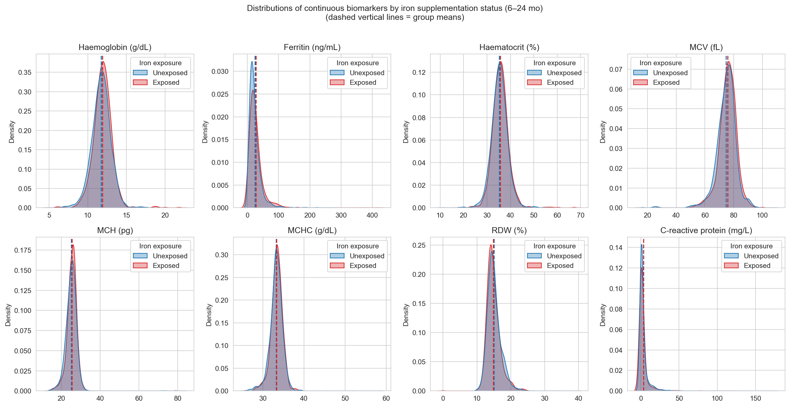
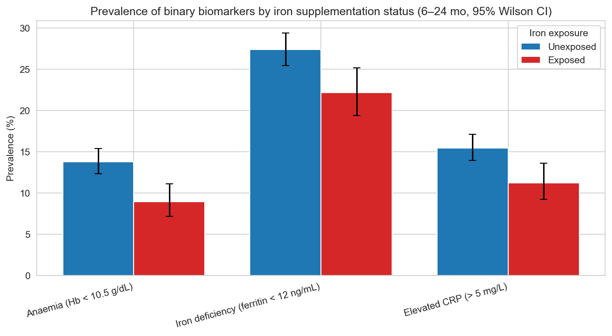
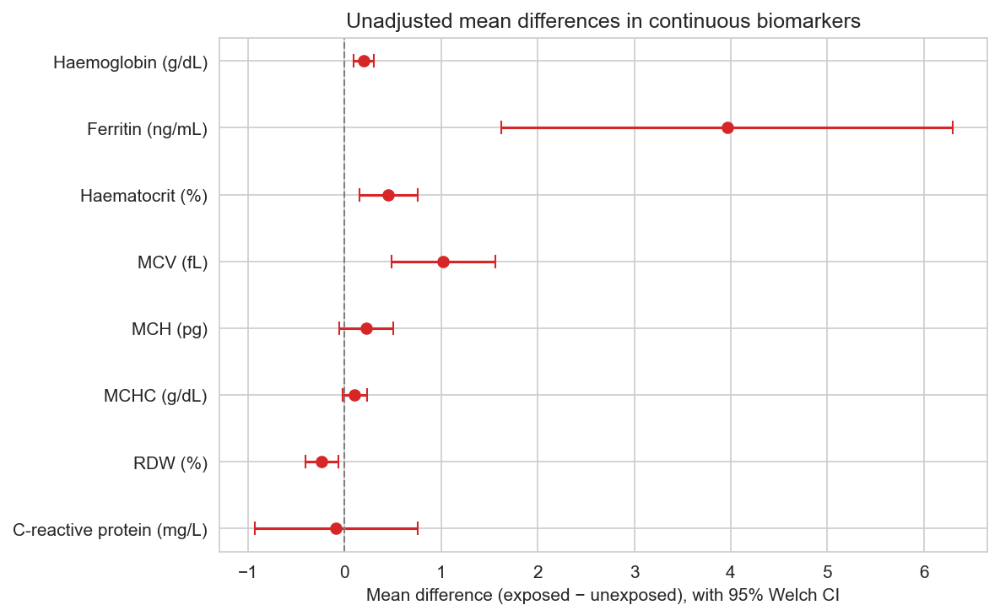
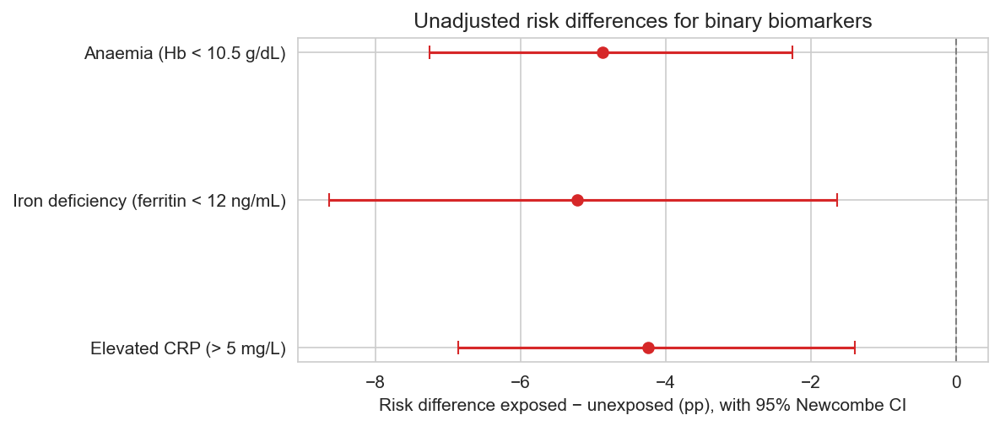

# 01 — Descriptive comparison of haematological and inflammatory biomarkers by iron supplementation status

**Sample:** Brazilian infants aged 6–24 months from ENANI-2019.

**Analytic n:** 4,601 infants. **Iron-exposed:** 1,353 (29.4%).

**Comparisons reported below are unadjusted.** Adjusted estimates with outer-bootstrap inference will follow in a separate notebook. No causal claim is made from this report.

---

## Biomarker availability

| Biomarker                             |   N (total) |   N (unexposed) |   N (exposed) |
|:--------------------------------------|------------:|----------------:|--------------:|
| Haemoglobin (g/dL)                    |        2788 |            1983 |           805 |
| Ferritin (ng/mL)                      |        2728 |            1929 |           799 |
| Haematocrit (%)                       |        2788 |            1983 |           805 |
| MCV (fL)                              |        2788 |            1983 |           805 |
| MCH (pg)                              |        2788 |            1983 |           805 |
| MCHC (g/dL)                           |        2788 |            1983 |           805 |
| RDW (%)                               |        2785 |            1982 |           803 |
| C-reactive protein (mg/L)             |        2756 |            1964 |           792 |
| Anaemia (Hb < 10.5 g/dL)              |        2788 |            1983 |           805 |
| Iron deficiency (ferritin < 12 ng/mL) |        2728 |            1929 |           799 |
| Elevated CRP (> 5 mg/L)               |        2756 |            1964 |           792 |

## Continuous biomarkers — group means and unadjusted mean differences (95% CI)

| Biomarker                 |   N (total) | Unexposed mean [95% CI]   | Exposed mean [95% CI]   | Mean diff [95% CI]      |   Welch p |   Mann–Whitney p |
|:--------------------------|------------:|:--------------------------|:------------------------|:------------------------|----------:|-----------------:|
| Haemoglobin (g/dL)        |        2788 | 11.72 [11.67, 11.78]      | 11.92 [11.83, 12.01]    | +0.198 [+0.094, +0.302] |    0.0002 |           0.0003 |
| Ferritin (ng/mL)          |        2728 | 23.78 [22.76, 24.81]      | 27.75 [25.65, 29.84]    | +3.962 [+1.626, +6.297] |    0.0009 |           0      |
| Haematocrit (%)           |        2788 | 35.29 [35.13, 35.44]      | 35.74 [35.49, 36.00]    | +0.454 [+0.153, +0.754] |    0.0031 |           0.0097 |
| MCV (fL)                  |        2788 | 74.70 [74.38, 75.02]      | 75.72 [75.29, 76.15]    | +1.023 [+0.489, +1.557] |    0.0002 |           0.0001 |
| MCH (pg)                  |        2788 | 25.14 [24.96, 25.32]      | 25.36 [25.15, 25.58]    | +0.221 [-0.058, +0.500] |    0.1205 |           0.0003 |
| MCHC (g/dL)               |        2788 | 33.25 [33.17, 33.32]      | 33.35 [33.25, 33.45]    | +0.105 [-0.019, +0.230] |    0.0983 |           0.0504 |
| RDW (%)                   |        2785 | 15.08 [14.99, 15.18]      | 14.85 [14.70, 14.99]    | -0.237 [-0.408, -0.066] |    0.0066 |           0.0026 |
| C-reactive protein (mg/L) |        2756 | 3.44 [3.02, 3.87]         | 3.36 [2.62, 4.09]       | -0.087 [-0.934, +0.760] |    0.8408 |           0.0003 |

## Continuous biomarkers — medians and IQRs

| Biomarker                 |   N (total) | Unexposed median [IQR]   | Exposed median [IQR]   |   Mann–Whitney p |
|:--------------------------|------------:|:-------------------------|:-----------------------|-----------------:|
| Haemoglobin (g/dL)        |        2788 | 11.80 [11.00, 12.50]     | 11.90 [11.20, 12.60]   |           0.0003 |
| Ferritin (ng/mL)          |        2728 | 18.20 [11.20, 28.90]     | 21.10 [13.15, 32.25]   |           0      |
| Haematocrit (%)           |        2788 | 35.30 [33.20, 37.30]     | 35.60 [33.60, 37.50]   |           0.0097 |
| MCV (fL)                  |        2788 | 75.50 [71.20, 78.80]     | 76.20 [72.50, 79.60]   |           0.0001 |
| MCH (pg)                  |        2788 | 25.20 [23.50, 26.70]     | 25.60 [24.10, 26.80]   |           0.0003 |
| MCHC (g/dL)               |        2788 | 33.30 [32.50, 34.10]     | 33.40 [32.60, 34.20]   |           0.0504 |
| RDW (%)                   |        2785 | 14.80 [13.80, 16.10]     | 14.50 [13.60, 15.85]   |           0.0026 |
| C-reactive protein (mg/L) |        2756 | 0.64 [0.24, 2.37]        | 0.47 [0.20, 1.83]      |           0.0003 |

## Binary biomarkers — prevalences and unadjusted risk differences (95% CI)

| Biomarker                             | Events / N (unexposed)   | Events / N (exposed)   | Unexposed prev [95% CI]   | Exposed prev [95% CI]   | Risk diff (pp) [95% CI]   | Test       |   p-value |
|:--------------------------------------|:-------------------------|:-----------------------|:--------------------------|:------------------------|:--------------------------|:-----------|----------:|
| Anaemia (Hb < 10.5 g/dL)              | 274 / 1983               | 72 / 805               | 13.82% [12.37, 15.41]     | 8.94% [7.16, 11.12]     | -4.87 [-7.26, -2.26]      | Chi-square |    0.0004 |
| Iron deficiency (ferritin < 12 ng/mL) | 528 / 1929               | 177 / 799              | 27.37% [25.43, 29.40]     | 22.15% [19.41, 25.16]   | -5.22 [-8.63, -1.64]      | Chi-square |    0.0046 |
| Elevated CRP (> 5 mg/L)               | 304 / 1964               | 89 / 792               | 15.48% [13.95, 17.15]     | 11.24% [9.22, 13.63]    | -4.24 [-6.86, -1.40]      | Chi-square |    0.004  |

## Distribution plots

Dashed vertical lines mark group means.

## Prevalence of binary biomarkers (95% Wilson CI on each bar)

## Forest plot — mean differences (continuous biomarkers, 95% Welch CI)

## Forest plot — risk differences (binary biomarkers, 95% Newcombe CI)

---

## Notes

- Estimates are unadjusted; confounding is not addressed at this stage.

- Children with missing biomarker measurement are excluded (NaN preserved); they are not classified as zero.

- No multiple-testing correction is applied at this stage.

- Sample sizes vary by biomarker because not every infant had every blood parameter measured under the ENANI protocol.

- Hospitalisation outcomes are excluded from the manuscript by design (see `NARRATIVE.md`).

- For right-skewed biomarkers (ferritin, CRP) Welch t-test on the raw scale and Mann–Whitney U on ranks may disagree; both are reported.
