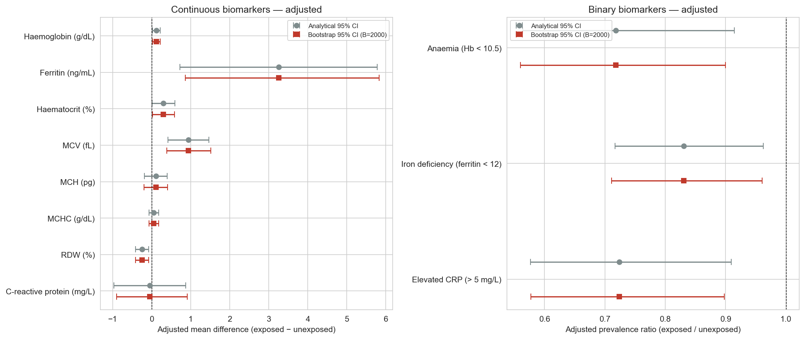
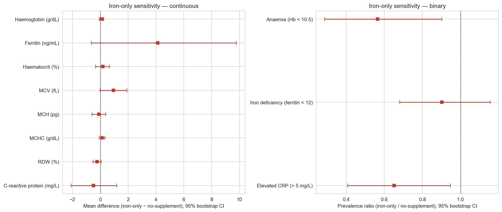
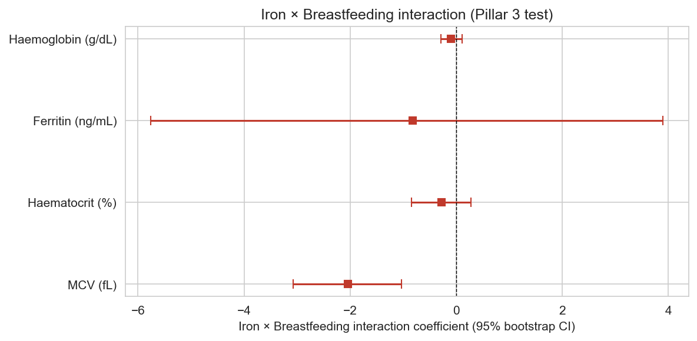

# 03 — Adjusted associations between iron supplementation and haematological / inflammatory biomarkers (B = 2000, MICE)

**Sample:** Brazilian infants 6–24 mo (ENANI-2019). N = 4,601.

**Method:** adjusted Poisson (binary) and OLS (continuous) regression with HC1 robust SE; 26 confounders; outer bootstrap B = 2000 with MICE imputation per resample; BH-FDR over seven primary outcomes.

---

## Missing data overview

| Variable        | Type       |   N missing | Pct missing   |
|:----------------|:-----------|------------:|:--------------|
| age_months      | Confounder |           0 | 0.00%         |
| male            | Confounder |           0 | 0.00%         |
| race_preta      | Confounder |           0 | 0.00%         |
| race_parda      | Confounder |           0 | 0.00%         |
| reg_norte       | Confounder |           0 | 0.00%         |
| reg_nordeste    | Confounder |           0 | 0.00%         |
| reg_sul         | Confounder |           0 | 0.00%         |
| reg_co          | Confounder |           0 | 0.00%         |
| urban           | Confounder |           0 | 0.00%         |
| ien             | Confounder |           0 | 0.00%         |
| ebia_leve       | Confounder |           0 | 0.00%         |
| ebia_mod        | Confounder |           0 | 0.00%         |
| ebia_grave      | Confounder |           0 | 0.00%         |
| esgoto_adeq     | Confounder |           0 | 0.00%         |
| agua_rede       | Confounder |           0 | 0.00%         |
| cesarean        | Confounder |           0 | 0.00%         |
| gest_weeks      | Confounder |           0 | 0.00%         |
| birth_weight    | Confounder |           0 | 0.00%         |
| prenatal_visits | Confounder |         361 | 7.85%         |
| maternal_age    | Confounder |           4 | 0.09%         |
| breastfed       | Confounder |           0 | 0.00%         |
| formula         | Confounder |           0 | 0.00%         |
| cow_milk        | Confounder |           0 | 0.00%         |
| educ_primary    | Confounder |           0 | 0.00%         |
| educ_secondary  | Confounder |           0 | 0.00%         |
| educ_tertiary   | Confounder |           0 | 0.00%         |
| hb              | Outcome    |        1813 | 39.40%        |
| ferritin        | Outcome    |        1873 | 40.71%        |
| haematocrit     | Outcome    |        1813 | 39.40%        |
| mcv             | Outcome    |        1813 | 39.40%        |
| mch             | Outcome    |        1813 | 39.40%        |
| mchc            | Outcome    |        1813 | 39.40%        |
| rdw             | Outcome    |        1816 | 39.47%        |
| crp             | Outcome    |        1845 | 40.10%        |
| anaemia         | Outcome    |        1813 | 39.40%        |
| iron_deficiency | Outcome    |        1873 | 40.71%        |
| crp_elevated    | Outcome    |        1845 | 40.10%        |

## Primary adjusted estimates (analytical + bootstrap)

| Outcome                         | Measure   |   Estimate | CI 95% (analytical)   |   p (analytical) | CI 95% (bootstrap)   |   p (bootstrap) |    N |   BH-FDR (boot) |
|:--------------------------------|:----------|-----------:|:----------------------|-----------------:|:---------------------|----------------:|-----:|----------------:|
| Haemoglobin (g/dL)              | beta      |  0.124226  | [0.0247, 0.2238]      |      0.0144601   | [0.0214, 0.2223]     |           0.011 | 2788 |       0.0128333 |
| Ferritin (ng/mL)                | beta      |  3.25642   | [0.7285, 5.7844]      |      0.0115778   | [0.8643, 5.8328]     |           0.009 | 2728 |       0.0128333 |
| Haematocrit (%)                 | beta      |  0.299353  | [0.0079, 0.5908]      |      0.0440752   | [0.0209, 0.5852]     |           0.035 | 2788 |       0.035     |
| MCV (fL)                        | beta      |  0.943027  | [0.4157, 1.4704]      |      0.000457063 | [0.3906, 1.5158]     |           0     | 2788 |       0         |
| MCH (pg)                        | beta      |  0.106615  | [-0.1867, 0.4000]     |      0.476281    | [-0.1923, 0.4064]    |           0.451 | 2788 |     nan         |
| MCHC (g/dL)                     | beta      |  0.0556895 | [-0.0664, 0.1778]     |      0.371217    | [-0.0703, 0.1788]    |           0.394 | 2788 |     nan         |
| RDW (%)                         | beta      | -0.244173  | [-0.4114, -0.0769]    |      0.004217    | [-0.4105, -0.0787]   |           0.004 | 2785 |     nan         |
| C-reactive protein (mg/L)       | beta      | -0.0496481 | [-0.9721, 0.8728]     |      0.915984    | [-0.8987, 0.9108]    |           0.907 | 2756 |     nan         |
| Anaemia (Hb < 10.5)             | PR        |  0.71808   | [0.5638, 0.9145]      |      0.00727812  | [0.5600, 0.8997]     |           0.003 | 2788 |       0.007     |
| Iron deficiency (ferritin < 12) | PR        |  0.83066   | [0.7168, 0.9626]      |      0.0136043   | [0.7109, 0.9608]     |           0.01  | 2728 |       0.0128333 |
| Elevated CRP (> 5 mg/L)         | PR        |  0.723973  | [0.5765, 0.9092]      |      0.00544473  | [0.5771, 0.8981]     |           0.003 | 2756 |       0.007     |

### Forest plot of primary estimates

## Sensitivity — iron alone versus no supplement

Restricts to infants exposed to iron alone (no co-supplementation) versus infants who received no supplement at all (n ≈ 1,095). Isolates iron-specific effect from the broader supplementation pattern.

| Outcome                         | Measure   |   Estimate | CI 95% (analytical)   |   p (analytical) | CI 95% (bootstrap)   |   p (bootstrap) |    N |
|:--------------------------------|:----------|-----------:|:----------------------|-----------------:|:---------------------|----------------:|-----:|
| Haemoglobin (g/dL)              | beta      |  0.096103  | [-0.0746, 0.2668]     |        0.269895  | [-0.0783, 0.2560]    |           0.271 | 1095 |
| Ferritin (ng/mL)                | beta      |  4.13104   | [-1.2301, 9.4922]     |        0.130978  | [-0.6522, 9.7877]    |           0.106 | 1066 |
| Haematocrit (%)                 | beta      |  0.174535  | [-0.3257, 0.6748]     |        0.494072  | [-0.3370, 0.6661]    |           0.499 | 1095 |
| MCV (fL)                        | beta      |  0.947602  | [0.0184, 1.8768]      |        0.0456296 | [-0.0038, 1.9066]    |           0.053 | 1095 |
| MCH (pg)                        | beta      | -0.0900313 | [-0.5708, 0.3908]     |        0.713618  | [-0.6035, 0.3848]    |           0.743 | 1095 |
| MCHC (g/dL)                     | beta      |  0.132254  | [-0.0733, 0.3378]     |        0.207313  | [-0.0741, 0.3349]    |           0.216 | 1095 |
| RDW (%)                         | beta      | -0.242235  | [-0.5278, 0.0434]     |        0.0964477 | [-0.5269, 0.0631]    |           0.119 | 1093 |
| C-reactive protein (mg/L)       | beta      | -0.489405  | [-2.1522, 1.1734]     |        0.56402   | [-2.1090, 1.1830]    |           0.558 | 1078 |
| Anaemia (Hb < 10.5)             | PR        |  0.564923  | [0.3323, 0.9603]      |        0.0348995 | [0.2866, 0.9017]     |           0.011 | 1095 |
| Iron deficiency (ferritin < 12) | PR        |  0.901842  | [0.6950, 1.1703]      |        0.437129  | [0.6805, 1.1551]     |           0.42  | 1066 |
| Elevated CRP (> 5 mg/L)         | PR        |  0.651739  | [0.4309, 0.9858]      |        0.042573  | [0.4076, 0.9467]     |           0.019 | 1078 |

## Sensitivity — inverse-probability-of-censoring weighting (IPCW)

Stabilised IPCW weights re-fit every adjusted model on respondents only, weighting by the inverse predicted probability of biomarker measurement (logit of response on iron + 26 confounders). Concordance between primary and IPCW estimates supports a missing-at-random response mechanism conditional on the measured covariates.

| Outcome                         | Measure   |   Primary estimate | Primary CI 95%     |   IPCW estimate | IPCW CI 95%        |      IPCW p | Response rate   |   Mean weight | Weight range   |   N respondents |
|:--------------------------------|:----------|-------------------:|:-------------------|----------------:|:-------------------|------------:|:----------------|--------------:|:---------------|----------------:|
| Haemoglobin (g/dL)              | beta      |          0.124226  | [0.0247, 0.2238]   |       0.116528  | [0.0140, 0.2191]   | 0.0259614   | 60.6%           |         1     | [0.683, 1.964] |            2788 |
| Ferritin (ng/mL)                | beta      |          3.25642   | [0.7285, 5.7844]   |       3.19439   | [0.7552, 5.6336]   | 0.0102649   | 59.3%           |         0.999 | [0.705, 1.983] |            2728 |
| Haematocrit (%)                 | beta      |          0.299353  | [0.0079, 0.5908]   |       0.309662  | [0.0086, 0.6107]   | 0.0438003   | 60.6%           |         1     | [0.683, 1.964] |            2788 |
| MCV (fL)                        | beta      |          0.943027  | [0.4157, 1.4704]   |       0.948069  | [0.4009, 1.4953]   | 0.000684187 | 60.6%           |         1     | [0.683, 1.964] |            2788 |
| MCH (pg)                        | beta      |          0.106615  | [-0.1867, 0.4000]  |       0.0494873 | [-0.2678, 0.3667]  | 0.75981     | 60.6%           |         1     | [0.683, 1.964] |            2788 |
| MCHC (g/dL)                     | beta      |          0.0556895 | [-0.0664, 0.1778]  |       0.0256512 | [-0.0926, 0.1439]  | 0.670742    | 60.6%           |         1     | [0.683, 1.964] |            2788 |
| RDW (%)                         | beta      |         -0.244173  | [-0.4114, -0.0769] |      -0.253555  | [-0.4205, -0.0866] | 0.002915    | 60.5%           |         1     | [0.682, 1.944] |            2785 |
| C-reactive protein (mg/L)       | beta      |         -0.0496481 | [-0.9721, 0.8728]  |      -0.0350545 | [-0.9767, 0.9066]  | 0.941836    | 59.9%           |         1     | [0.701, 2.140] |            2756 |
| Anaemia (Hb < 10.5)             | PR        |          0.71808   | [0.5638, 0.9145]   |       0.725258  | [0.5678, 0.9265]   | 0.0101288   | 60.6%           |         1     | [0.683, 1.964] |            2788 |
| Iron deficiency (ferritin < 12) | PR        |          0.83066   | [0.7168, 0.9626]   |       0.843356  | [0.7299, 0.9744]   | 0.020784    | 59.3%           |         0.999 | [0.705, 1.983] |            2728 |
| Elevated CRP (> 5 mg/L)         | PR        |          0.723973  | [0.5765, 0.9092]   |       0.712412  | [0.5680, 0.8936]   | 0.00335192  | 59.9%           |         1     | [0.701, 2.140] |            2756 |

## Iron × breastfeeding interaction (continuous outcomes — Pillar 3 test)

Pre-specified test of whether breastfeeding modifies the iron-supplementation–biomarker association on the four central continuous outcomes.

| Outcome            |   Interaction coef | CI 95% (analytical)   |   p (analytical) | CI 95% (bootstrap)   |   p (bootstrap) |    N |
|:-------------------|-------------------:|:----------------------|-----------------:|:---------------------|----------------:|-----:|
| Haemoglobin (g/dL) |         -0.0958292 | [-0.2920, +0.1003]    |      0.338303    | [-0.2866, +0.1094]   |           0.337 | 2788 |
| Ferritin (ng/mL)   |         -0.822288  | [-5.4855, +3.8410]    |      0.729637    | [-5.7577, +3.9041]   |           0.718 | 2728 |
| Haematocrit (%)    |         -0.275577  | [-0.8498, +0.2986]    |      0.346861    | [-0.8400, +0.2853]   |           0.334 | 2788 |
| MCV (fL)           |         -2.04596   | [-3.0521, -1.0398]    |      6.73631e-05 | [-3.0766, -1.0299]   |           0     | 2788 |

---

## Notes

- Adjusted estimates use 26 confounders with HC1 robust SEs.

- MICE (Bayesian-ridge IterativeImputer) imputes covariates with missingness per bootstrap resample; outcomes are never imputed.

- Bootstrap p-value = 2 × min(tail probability of crossing zero).

- BH-FDR computed over the seven primary outcomes only.

- No causal claim is made from these estimates.
