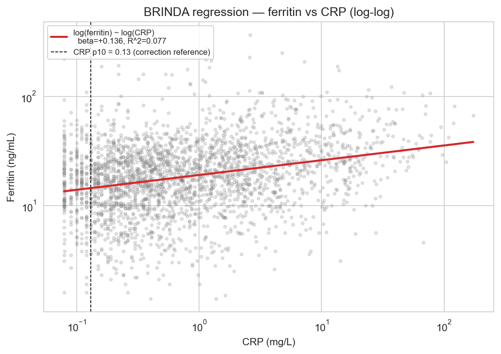
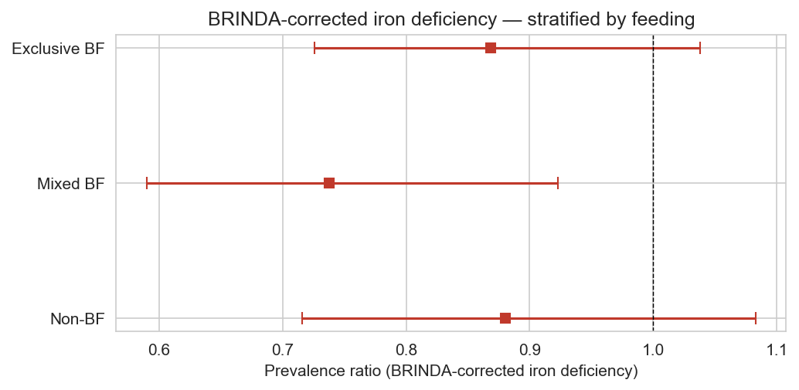

# 04 — BRINDA inflammation correction and negative-control sensitivity

**Sample:** Brazilian infants 6–24 mo (ENANI-2019). N = 4,601; biomarker-with-CRP subsample n = 2,656.

**Methods:** BRINDA regression-correction (CRP-only, beta_CRP = +0.1355, CRP p10 = 0.130 mg/L); adjusted Poisson / OLS with HC1 robust SE; outer bootstrap B = 2000 with MICE imputation per resample; 26 confounders.

---

## BRINDA regression diagnostic

## Adjusted associations on BRINDA-corrected outcomes

| Outcome                                         | Measure   |   Estimate | CI 95% (analytical)   |   p (analytical) | CI 95% (bootstrap)   |   p (bootstrap) |    N |
|:------------------------------------------------|:----------|-----------:|:----------------------|-----------------:|:---------------------|----------------:|-----:|
| Ferritin (BRINDA-corrected, ng/mL)              | beta      |   2.71234  | [0.9865, 4.4382]      |       0.00206836 | [1.0717, 4.4353]     |           0.001 | 2656 |
| Iron deficiency (BRINDA-corrected, ferritin<12) | PR        |   0.821602 | [0.7305, 0.9241]      |       0.00105403 | [0.7298, 0.9272]     |           0.002 | 2656 |

## BRINDA-corrected iron deficiency by feeding stratum

| Stratum      |    N |   Events |       PR | CI 95%         |          p |
|:-------------|-----:|---------:|---------:|:---------------|-----------:|
| Exclusive BF |  620 |      314 | 0.868204 | [0.726, 1.038] | 0.120316   |
| Mixed BF     |  749 |      295 | 0.737691 | [0.590, 0.923] | 0.00776814 |
| Non-BF       | 1287 |      376 | 0.880268 | [0.716, 1.083] | 0.22733    |

## Iron × breastfeeding interaction on BRINDA-corrected iron deficiency

| Outcome                            |   Interaction coef (log-PR) | CI 95% (analytical)   |   p (analytical) | CI 95% (bootstrap)   |   p (bootstrap) |    N |
|:-----------------------------------|----------------------------:|:----------------------|-----------------:|:---------------------|----------------:|-----:|
| Iron deficiency (BRINDA-corrected) |                  -0.0511866 | [-0.2976, +0.1952]    |         0.683879 | [-0.2962, +0.1943]   |            0.69 | 2656 |

## Negative-control sensitivity — accidental hospitalisation

| Outcome                                       | Measure   |   Estimate | CI 95% (analytical)   |   p (analytical) | CI 95% (bootstrap)   |   p (bootstrap) |    N |   Events |
|:----------------------------------------------|:----------|-----------:|:----------------------|-----------------:|:---------------------|----------------:|-----:|---------:|
| Accidental hospitalisation (negative control) | PR        |   0.955814 | [0.386, 2.370]        |         0.922286 | [0.261, 2.271]       |           0.894 | 4601 |       22 |

---

## Notes

- BRINDA correction uses CRP only because AGP is not measured in ENANI-2019.

- Stratified PRs are analytical (HC1) without bootstrap; the formal interaction test is bootstrapped.

- A null negative-control result supports the design; a non-null result would flag residual confounding.
